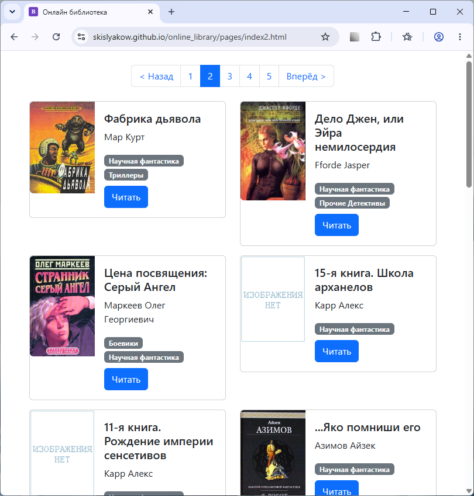

<div align="center">

# 📚 Онлайн библиотека

**Учебный проект онлайн-библиотеки** — статический сайт с книгами, разбитый на страницы, с удобной навигацией и автоперезагрузкой при разработке.

[](https://skislyakow.github.io/online_library/)
[](https://getbootstrap.com/)
[](https://python.org)
[](https://jinja.palletsprojects.com/)
[](https://github.com/lepture/python-livereload)
[](LICENSE)



</div>

---

## 🧐 О проекте

Проект создан в рамках обучения на курсе [Devman](https://devman.org).  
Это статический сайт онлайн-библиотеки, где можно просматривать книги, читать их онлайн и переходить между страницами.

**👉 [Открыть опубликованную версию](https://skislyakow.github.io/online_library/)**

## ✨ Возможности

- 📖 **Каталог книг** — 92 книги с обложками, авторами и жанрами
- 📄 **Пагинация** — разбивка по страницам (20 книг на страницу)
- 🔗 **Чтение онлайн** — каждая книга открывается по ссылке
- 🎨 **Двухколоночная сетка** на Bootstrap 5
- 🏷️ **Жанры** в виде бейджей
- 📱 **Адаптивная вёрстка** — 2 колонки на десктопе, 1 на мобильных
- 🔌 **Автоперезагрузка** при разработке через livereload
- 📡 **Работает офлайн** — Bootstrap и фавикон загружаются локально

## 🛠️ Технологии

| Технология | Назначение |
|---|---|
| [Python 3](https://python.org) | Генерация страниц |
| [Jinja2](https://jinja.palletsprojects.com/) | Шаблонизация HTML |
| [Bootstrap 5.3](https://getbootstrap.com/) | Стили и сетка |
| [livereload](https://github.com/lepture/python-livereload) | Автоперезагрузка в браузере |
| [more-itertools](https://more-itertools.readthedocs.io/) | Разбивка списков на chunks |
| [GitHub Pages](https://pages.github.com/) | Хостинг статики |

## 🚀 Быстрый старт

### Локальный запуск

```bash
# Клонировать репозиторий
git clone https://github.com/skislyakow/online_library.git
cd online_library

# Создать и активировать виртуальное окружение
python -m venv .venv
source .venv/bin/activate    # Linux/macOS
.venv\Scripts\activate       # Windows (PowerShell)

# Установить зависимости
pip install -r requirements.txt

# Сгенерировать статические страницы
python render_website.py

# Запустить сервер с автоперезагрузкой
python server.py
```

Открыть в браузере: [http://127.0.0.1:5500](http://127.0.0.1:5500)

### Простая генерация без сервера

```bash
python render_website.py
```

После этого можно открыть `index.html` прямо в браузере.

## 📁 Структура проекта

```
online_library/
├── index.html                 # Редирект на первую страницу
├── pages/
│   ├── index1.html           # Книги 1–20
│   ├── index2.html           # Книги 21–40
│   ├── index3.html           # Книги 41–60
│   ├── index4.html           # Книги 61–80
│   └── index5.html           # Книги 81–92
├── static/
│   ├── bootstrap.min.css     # Bootstrap CSS (локально)
│   ├── bootstrap.bundle.min.js  # Bootstrap JS (локально)
│   └── favicon.svg           # Фавикон
├── books/
│   ├── meta_data.json        # Метаданные книг
│   ├── img/                  # Обложки книг
│   └── books/                # Тексты книг
├── templates/
│   └── index.html            # Jinja2-шаблон
├── render_website.py         # Генератор страниц
├── server.py                 # Сервер с livereload
└── screenshot.png            # Скриншот сайта
```

## 📦 Зависимости

```
jinja2
livereload
more-itertools
```

## 🌐 Публикация на GitHub Pages

Сайт уже опубликован по адресу:  
**👉 [https://skislyakow.github.io/online_library/](https://skislyakow.github.io/online_library/)**

Для публикации своей версии:

1. Сделайте форк репозитория
2. В настройках репозитория (Settings → Pages) выберите ветку `main` и папку `/ (root)`
3. Сохраните — через минуту сайт будет доступен по адресу `https://<username>.github.io/<repository>/`

## 🎓 Обучение

Проект выполнен в рамках курса по веб-разработке **[Devman](https://devman.org)**.

## 📄 Лицензия

Проект распространяется под лицензией MIT.
